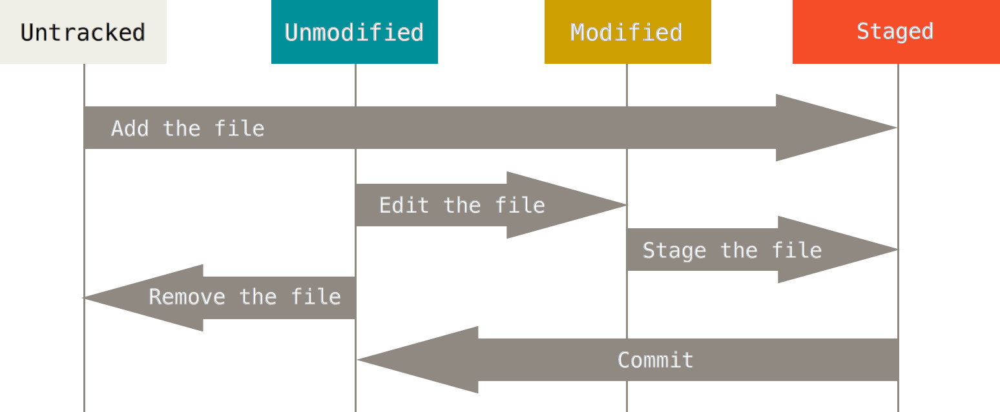

###################
Presentation de git
###################

:title: Présetation de git
:data-transition-duration: 1500
:css: git-presentation.css
:skip-help: true

On peut générer la présentation à l'aide de la commande suivante :

    hovercraft git-presentation.rst presentation

Et ensuite, on peut simplement lire le fichier

    presentation/index.html

avec un navigateur internet (firefox, …)

----------

*****************************
Qu'est ce que c'est que *git*
*****************************

.. image:: git-logo.jpg
   :align: center
   :width: 55%

----------

:data-rotate-x: 100

**********************************
Git est un gestionnaire de version
**********************************

- faire des tests sans craintes
- historique d'annulation arborescent
- partager son travail
- fusionner des modifications

----------

*******
Exemple
*******

.. image:: git-tree.png
   :align: center
   :width: 55%

----------

***********
Assez parlé
***********

*Cloner* un dépôt.

.. code:: bash

    git clone https://code.google.com/p/robotronik.test

Créer une *branche* et basculer dessus.

.. code:: bash

    git checkout -b <nom_de_la_branche>

----------

*****************
Créer un *commit*
*****************

.. code:: bash

    ## On fabrique un <fichier>
    git add <fichier>
    git commit <fichier>
    ## On met un message de commit

Connaitre l'état du dépot.

.. code:: bash

    git status
    git log

----------

***********************
Les messages de commits
***********************

Un commit s'écrit de cette façon :

    - Un résumé très court sur une ligne
    - Une ligne vide
    - Une explication détaillée

.. code:: text

    Ajout premier fichier.

    Ce fichier contient des modifications
    importantes, voir vitales pour l’avenir
    du club. Ces modifications ne sont pas
    triviales, je vais donc les expliquer ici.

    « On va tout poutrer à la coupe »

----------

**********************
Retour sur les commits
**********************

.. code:: bash

    git add <fichier1> <fichier2> ...
    git commit
    <ajout du message de commit>

.. code:: bash

    git commit <fichier1> <fichier2> ...
    <ajout du message de commit>

.. code:: bash

    git add <fichier1> <fichier2> ...
    git commit -m "message de commit"

.. code:: bash

    git commit -a
    <ajout du message de commit>

.. code:: bash

    git commit -a -m "message de commit"

----------

:data-rotate-x: 200

**********************************
Déplacer et supprimer des fichiers
**********************************

.. code:: bash

    git rm <fichier> <fichier2> ...
    git mv <fichier> <fichier2> ...

.. code:: bash

    # Fichier déplacer en dehors de git
    git rm --cached <old_fichier> <old_fichier2> ...
    git add <fichier> <fichier2> ...

----------

*********************
Utiliser l'historique
*********************

Restaurer l'état d'un ancien commit :

.. code:: bash

    git log
    git checkout <SHA-1>

Modifier le dernier commit :

- Changer le message de commit
- Ajouter/supprimer des fichiers

.. code:: bash

    git commit
    # Il y a eu un oubli
    # Faire les modification
    git checkout --amend

-----------

***********************
Le fichier *.gitignore*
***********************

- Permet d'ignorer des fichiers
- Très utile pour les fichiers générés
- Par exemple les fichiers .o

----------

:data-rotate-x: 300

********************
Partager ses commits
********************

Envoyer une branche sur le serveur

.. code:: bash

    git push <nom_de_la_branche>

Récupérer une branche sur le serveur

.. code:: bash

    git pull

.. code:: bash

    git fetch
    git merge

.. note::

    Parler des merges

-----------

***********************
Retour sur les branches
***********************

Créer une branche et basculer immédiatement dessus :

.. code:: bash

    git checkout -b <nom_de_la_branche>

Lister toutes les branches

.. code:: bash

    git branch

Basculer sur une branche

.. code:: bash

    git branch <nom_de_la_branche>

.. note::

    - Parler de gitk

-----------

**********
Les *tags*
**********

Permet de repérer facilement un commit.

- Par exemple une version majeure
- Ou encore une amélioration 

.. code:: bash

    git tag

-----------

:data-rotate-x: 100

*************************
D'autres commandes utiles
*************************

Mettre de côté le travail courant et le restaurer.

.. code:: bash

    git help

    git stash
    git stash --apply
    git cherry-pick
    git submodule

-----------

:data-y: 100

********************
Retour sur l'exemple
********************

.. image:: git-tree.png
   :align: center
   :width: 55%

